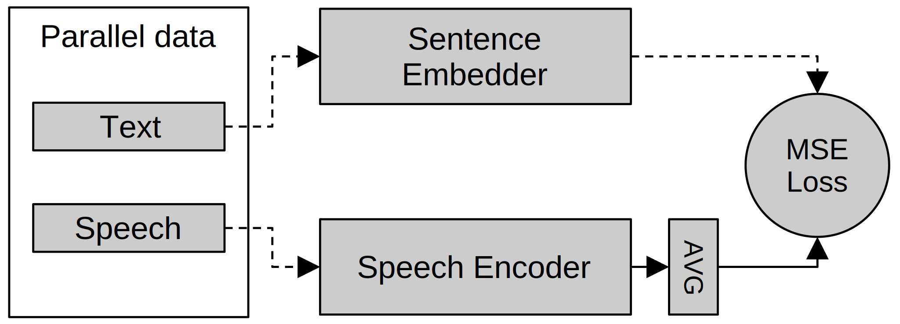

# Sentence Embedder Guided Utterance Encoder (SEGUE) for Spoken Language Understanding

[Paper](segue.pdf) | [Model checkpoint](https://huggingface.co/declare-lab/segue-w2v2-base)

SEGUE is a pre-training approach for sequence-level spoken language understanding (SLU) 
tasks. We use knowledge distillation on a parallel speech-text corpus (e.g. an ASR corpus)
to distil language understanding knowledge from a textual sentence embedder to a pre-trained
speech encoder.
SEGUE applied to Wav2Vec 2.0 improves performance for many SLU tasks, including intent classification / slot-filling,
spoken sentiment analysis, and spoken emotion classification. These improvements were
observed in both fine-tuned and non-fine-tuned settings, as well as few-shot settings.



## Usage

### Requirements

We provide a conda environment file `environment.yml` for reference, though the packages such as PyTorch and CUDA support may need to be installed manually depending on your system setup.

### Pre-training

*Note: we provide a [pre-trained checkpoint](https://huggingface.co/declare-lab/segue-w2v2-base), so you may skip this step if you want to run downstream tasks.*

Use the pre-training script `pretrain_segue.py`, for example:

```bash
python -m torch.distributed.launch pretrain_segue.py
```

After that, optionally use `pretrain_avg.py` for checkpoint averaging:

```bash
python pretrain_avg.py
```

Modify the above scripts as appropriate for your use case, e.g. output directories,
training settings, range of checkpoints to average, HF Datasets cache directory.

### Downstream tasks

The downstream task scripts we used are under the `tasks/` directory. Each task may have
some or all of the following scripts:

 - `*avg.py` for task-specific checkpoint averaging
 - `finetune.py` for task-specific fine-tuning
 - `finetune_w2v2.py` if Wav2Vec 2.0 requires different training settings than SEGUE's
 - `train_tl.py` for task-specific transfer learning w/ a frozen backbone
 - `few_shot.py` for few-shot learning

Modify the above scripts as appropriate for your use case, e.g. output directories,
training settings, range of checkpoints to average, HF Datasets cache directory.

If you want to write your own tasks, we also have the classes `SegueForRegression` and `SegueForClassification`. For classification, the number of classes can be specified
through the `n_classes` field in model config,
e.g. `SegueForClassification.from_pretrained('...', n_classes=7)`. Multi-label classification
is also supported, e.g. `n_classes=[3, 7]` for two labels with 3 and 7 classes respectively.

### Other files

 - `plots/` - scatterplot scripts for few-shot tasks
 - `segue/` - model classes
 - `custom_trainer.py` - a custom `Trainer` class for logging additional metrics

## Results

We show only simplified MInDS-14 and MELD results for brevity.
Please refer to the paper for full results.

### MInDS-14 (intent classification)

*Note: we used only the en-US subset of MInDS-14.*

#### Fine-tuning

|Model|Accuracy|
|-|-|
|w2v 2.0|89.4&plusmn;2.3|
|SEGUE|**97.6&plusmn;0.5**|

*Note: Wav2Vec 2.0 fine-tuning was unstable. Only 3 out of 6 runs converged, the result shown were taken from converged runs only.*

#### Frozen encoder

|Model|Accuracy|
|-|-|
|w2v 2.0|54.0|
|SEGUE|**77.9**|

#### Few-shot

Plots of k-shot per class accuracy against k:


### MELD (sentiment and emotion classification)

#### Fine-tuning

|Model|Sentiment F1|Emotion F1|
|-|-|-|
|w2v 2.0|47.3|39.3|
|SEGUE|53.2|41.1|
|SEGUE (higher LR)|**54.1**|**47.2**|

*Note: Wav2Vec 2.0 fine-tuning was unstable at the higher LR.*

#### Frozen encoder

|Model|Sentiment F1|Emotion F1|
|-|-|-|
|w2v 2.0|45.0&plusmn;0.7|34.3&plusmn;1.2|
|SEGUE|**45.8&plusmn;0.1**|**35.7&plusmn;0.3**|

#### Few-shot

Plots of MELD k-shot per class F1 score against k - sentiment and emotion respectively:


## Limitations

In the paper, we hypothesized that SEGUE may perform worse on tasks that rely less on
understanding and more on word detection. This may explain why SEGUE did not manage to
improve upon Wav2Vec 2.0 on the Fluent Speech Commands (FSC) task. We also experimented with
an ASR task (FLEURS), which heavily relies on word detection, to further demonstrate this.

However, this is does not mean that SEGUE performs worse on intent classification tasks
in general. MInDS-14, was able to benifit greatly from SEGUE despite also being an intent
classification task, as it has more free-form utterances that may benefit more from
understanding.

## Citation

```bibtex
@inproceedings{segue2023,
  title={Sentence Embedder Guided Utterance Encoder (SEGUE) for Spoken Language Understanding},
  author={Tan, Yi Xuan and Majumder, Navonil and Poria, Soujanya},
  booktitle={Interspeech},
  year={2023}
}
```
